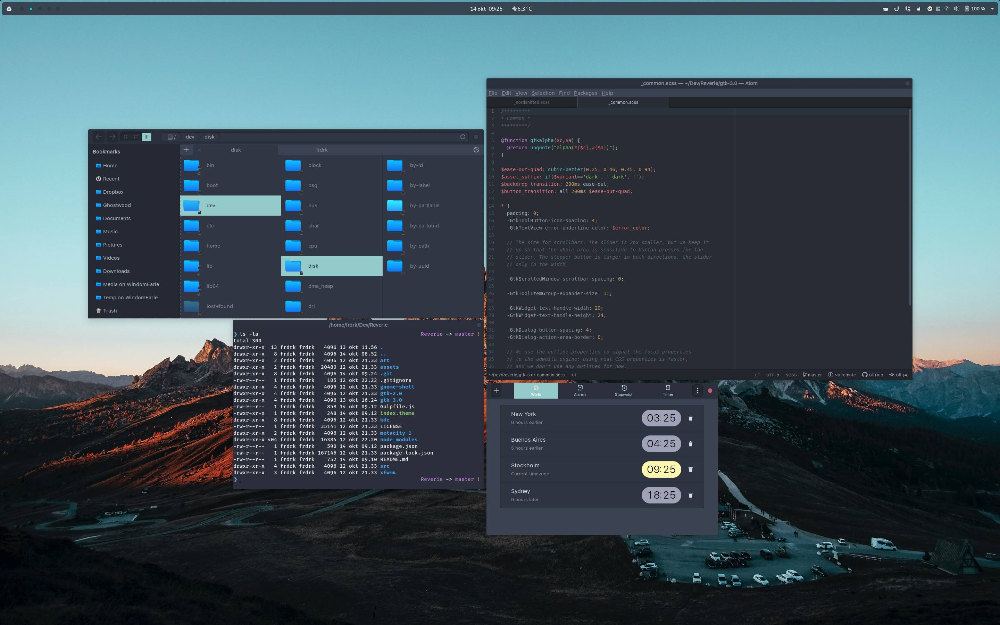

> Nordic is a Gtk3.20+ theme based on the fantastic [Nordic](https://github.com/EliverLara/Nordic) color palette.

#### Wat?
Fork of [Nordic](https://github.com/EliverLara/Nordic) with the palette shifted towards darker and slightly more saturated and luminous colors. Floating Gnome top panel.


#### Installation

Extract the zip file to the themes directory i.e. `/usr/share/themes/` or `~/.themes/` (create it if necessary).

To set the theme on Gnome, run the following commands in Terminal:

```
gsettings set org.gnome.desktop.interface gtk-theme "Reverie"
gsettings set org.gnome.desktop.wm.preferences theme "Reverie"
```
or Change via distribution specific tool.

#### Notes

This theme is not actively maintained. YMMV.